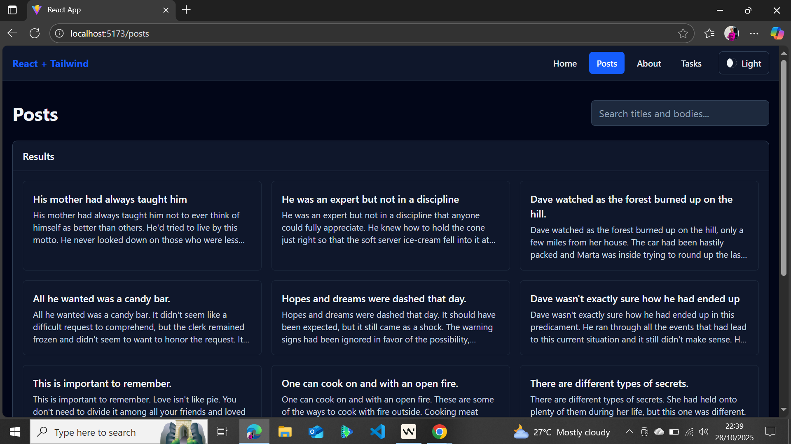
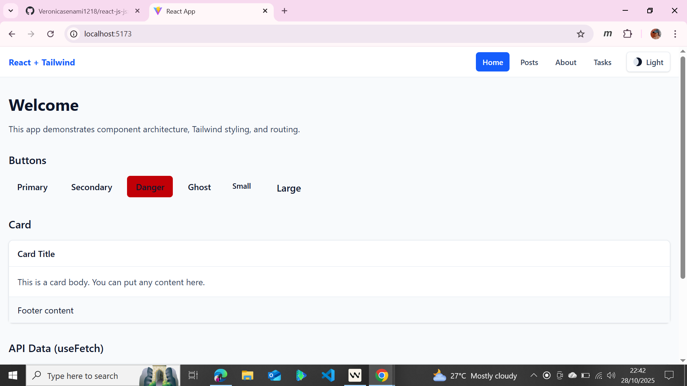

# React + Tailwind App (Vite)

Live Demo: https://tasks-posts.netlify.app/

Local Dev URL: http://localhost:5173

This repository contains a responsive React application built with Vite and Tailwind CSS. It demonstrates component architecture, state management with hooks, theme switching (light/dark), and API integration with loading/error handling, pagination, and search.

## Highlights

- **Routing**: React Router with nested layout (`/`, `/about`, `/tasks`, `/posts`).
- **Reusable Components**: `Button`, `Card`, `Navbar`, `Footer`, `Layout`.
- **State & Hooks**: `TaskManager`, `useLocalStorage`, `useDebounce`.
- **Theme**: Light/Dark via `ThemeContext` and `ThemeToggle` with Tailwind `dark` variants.
- **API**: Fetch posts with pagination and search. Timeout + automatic fallback.
- **Responsive UI**: Mobile-first grids and spacing. Transitions and skeleton loaders.

## Project Structure

```
app/
├── index.html
├── postcss.config.js
├── tailwind.config.js
└── src/
    ├── main.jsx                  # Router + ThemeProvider + global CSS
    ├── index.css                 # Tailwind v4 import (@import "tailwindcss")
    ├── utils/
    │   └── cn.js                 # className utility
    ├── hooks/
    │   ├── useLocalStorage.js    # persisted state (tasks/theme)
    │   └── useDebounce.js        # debounced search
    ├── context/
    │   └── ThemeContext.jsx      # theme + toggleTheme (adds/removes html.dark)
    ├── components/
    │   ├── Button.jsx            # variants: primary, secondary, danger, ghost
    │   ├── Card.jsx              # boxed layout
    │   ├── Footer.jsx            # footer links + copy
+    │   ├── Layout.jsx            # wraps pages with Navbar/Footer
    │   ├── Navbar.jsx            # navigation + ThemeToggle
    │   ├── TaskManager.jsx       # add/complete/delete/filter
    │   └── ThemeToggle.jsx       # sun/moon icon with transitions
    ├── pages/
    │   ├── Home.jsx
    │   ├── About.jsx
    │   ├── Tasks.jsx             # uses TaskManager
    │   └── NotFound.jsx
    └── services/
        └── api.js                # fetchPosts with timeout + fallback

## Run Locally (quick)

- Dev server URL: http://localhost:5173
- Entry renders via `src/main.jsx` using `RouterProvider` and `ThemeProvider`.
- Note: `src/App.jsx` is a simple demo and not used by the router.

## Features by Task

- **Task 1: Project Setup**
  - Vite React app, Tailwind configured (`darkMode: 'class'`).
{{ ... }}
    ```js
    document.documentElement.classList.contains('dark')
    ```
  - Ensure containers use `dark:` classes, e.g., `Layout.jsx` has `dark:bg-slate-950 dark:text-slate-100`.

  ## Deployment
  
  1. Build the app:
     ```bash
     npm --prefix app run build
     ```
   2. Deploy `app/dist/` to your hosting provider (Vercel, Netlify, GitHub Pages, etc.).
   3. Update the Live Demo link at the top of this README with your deployed URL.

### Netlify

- Build command: `npm run build`
- Base directory: `app`
- Publish directory: `app/dist`
- Node version: 18+
- After deploy, set the site name in Netlify (optional) and replace the Live Demo placeholder.

### Vercel

- Framework Preset: Vite
- Root Directory: `app`
- Build Command: `npm run build`
- Output Directory: `dist`
## Screenshots

These screenshots are located in the `app/` folder of the repo.



